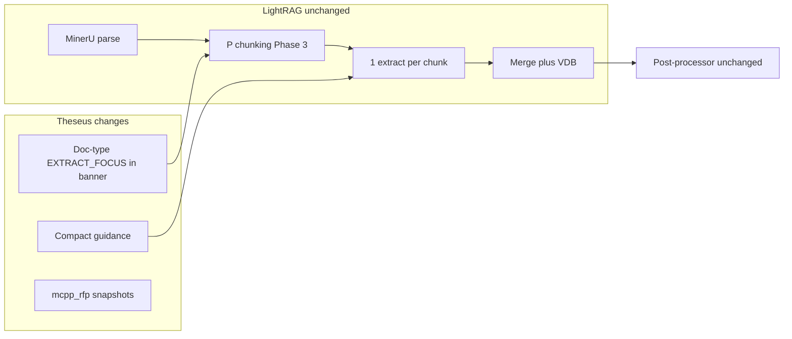

# Epic: Extraction Prompt Compression + P Chunking

**Branch:** `epic/extract-prompt-compression`  
**Regression workspace:** `mcpp_rfp` (not AFCAP5)  
**Reference:** [LIGHTRAG_GOVCON_EXTRACTION_ASSESSMENT.md](LIGHTRAG_GOVCON_EXTRACTION_ASSESSMENT.md)

---

## Goal

Improve govcon KG quality within **stock LightRAG** (parse → chunk → extract → merge → VDB/Neo4j). **Zero extra LLM calls per chunk** in Phases 1–3. Post-processor **unchanged** until quality gates pass.

---

## Quality over quantity (mandatory gate philosophy)

**Entity count and relationship count alone are not success metrics.**

| Do gate on | Do not gate on alone |
|---|---|
| Orphan rate (degree-0 entities) | `total_entities` up/down |
| Manual audit: document → section → factor tree | `total_relationships` up/down |
| Cross-doc link **correctness** (PWS task → eval factor) | Per-type count deltas without audit |
| `concept` / `unknown` / rogue rel keyword share | Strict-schema volume drop without spot-check |
| Post-processor edges added (`infer_lm_links`, `resolve_orphans`) | Dashboard headline entity totals |
| Known-answer query usefulness (optional Phase 4) | |

**Bloat signal:** totals rise while orphans, `concept`, or rogue keywords also rise.  
**Precision signal:** totals fall while tree audit and cross-doc samples improve.

---

## Architecture



**Out of scope this epic:** multi-pass extract, post-processor deletion, `concept` schema gating.

---

## Phase 0 — Baseline snapshot

**Tool:** `tools/snapshot_workspace_kg.py` (new)

Capture before any code changes → `run-dir/artifacts/mcpp_rfp_baseline_pre_epic.json`

**Snapshot fields (quality-first):**

- `orphan_rate_vdb`, `orphan_count_neo4j` (if Neo4j enabled)
- `entity_type_distribution` (context only — not a gate)
- `relationship_first_token_distribution` (canonical vs rogue)
- `structural_counts`: `document`, `document_section`, `evaluation_factor`, `proposal_instruction`, `work_scope_item` (context for audit)
- `post_processor_last_run` stats if parseable from processing log
- `chunk_count`, `doc_count` (normalization)

```powershell
.\.venv\Scripts\python.exe tools/snapshot_workspace_kg.py --workspace mcpp_rfp --output run-dir/artifacts/mcpp_rfp_baseline_pre_epic.json
```

---

## Phase 1 — Compact guidance (0 extra LLM calls)

| Task | File |
|---|---|
| `render_compact_index()`, `render_focus_paragraph()`, `render_extraction_guidance()` | [src/ontology/entity_catalog.py](../src/ontology/entity_catalog.py) |
| Wire compact guidance (not `render_part_d()`) | [src/server/native_lightrag_runtime.py](../src/server/native_lightrag_runtime.py) |
| Remove duplicate `{entity_types_guidance}` from user prompt | [prompts/govcon/extraction.py](../prompts/govcon/extraction.py) |
| Trim examples 7 → 3 (L↔M, workload, anti-pattern) | [prompts/entity_type/govcon.yaml](../prompts/entity_type/govcon.yaml) |

**Tests:** compact guidance char budget; all 32 names in index; user prompt has no duplicate Part D.

---

## Phase 1b — Doc-type focus in banner (0 extra LLM calls)

Extend [src/extraction/govcon_chunking.py](../src/extraction/govcon_chunking.py) banner with `[EXTRACT_FOCUS: ...]` from `EntityCatalog.render_focus_paragraph(doc_type)`.

All 32 types remain valid in schema — focus biases attention only.

---

## Phase 2 — Reprocess + gate

1. Clear `kv_store_llm_response_cache.json`
2. Re-ingest `mcpp_rfp`
3. Snapshot → `mcpp_rfp_post_phase1.json`
4. Run gate checklist (below)

### Gate checklist (Phase 2 → Phase 3)

- [ ] Orphan rate: down or flat (not up > 2 percentage points)
- [ ] Manual audit (n=20): document → section → factor paths mostly complete
- [ ] Cross-doc sample (n=10): PWS↔RFP links correct where expected
- [ ] `concept` + `unknown` share: down or flat
- [ ] Rogue rel first-tokens: down
- [ ] Post-processor `infer_lm_links` / `resolve_orphans` counts: down or flat
- [ ] **Entity/relationship totals:** recorded for context only — not pass/fail

---

## Phase 3 — P chunking trial

```
LIGHTRAG_PARSER=pdf:mineru-iteP,doc:mineru-iteP,docx:native-iteP,ppt*:mineru-iteP,xlsx:legacy
```

Reprocess `mcpp_rfp`, snapshot → `mcpp_rfp_post_phase3_p_chunking.json`, same gate checklist vs Phase 2.

**Rollback** if orphans rise or tree audit regresses — even if totals look “better.”

---

## Phase 4 — Epic close

- `run-dir/artifacts/mcpp_rfp_epic_results.md` — gate table + audit notes
- Update [LIGHTRAG_GOVCON_EXTRACTION_ASSESSMENT.md](LIGHTRAG_GOVCON_EXTRACTION_ASSESSMENT.md) with measured outcomes
- Decide follow-on epic (multi-pass, post-processor slim) from **audit failures**, not count deltas

---

## PR stack

1. `snapshot_workspace_kg.py` + tests  
2. `EntityCatalog` compact renderers + tests  
3. Runtime + prompt dedup + example trim + banner focus  
4. P chunking + gate report  

---

## Cost

| Item | LLM calls |
|---|---|
| Phases 1–1b | Same 1/chunk; fewer input tokens |
| Phase 2–3 reprocess | One-time validation ingest |
| Post-processor | Unchanged |

---

## Follow-on epic (if gates incomplete)

- Pass 1 skeleton + Pass 3 workspace cross-doc
- Post-processor slim
- `concept` strict-schema gating