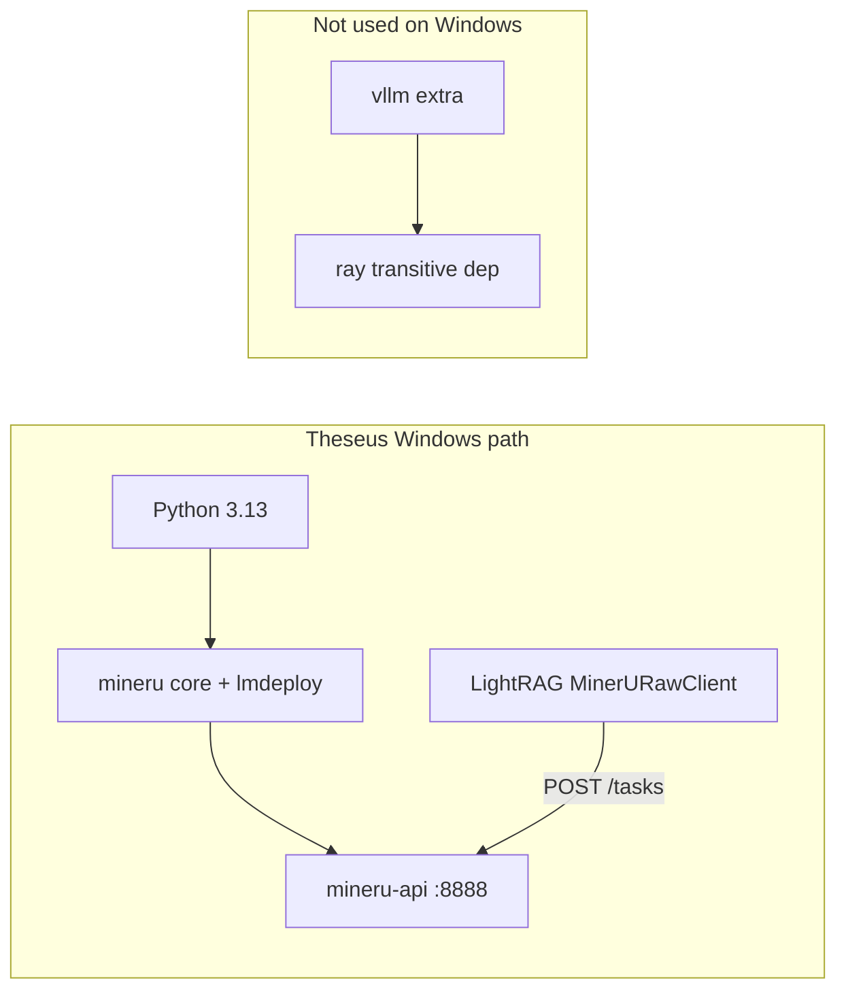

# MinerU 3.3 + LightRAG Alignment Plan

**Project:** Theseus (`govcon-capture-vibe`)  
**Date:** 2026-06-16  
**Branch:** `203-mineru-lightrag-alignment`  
**Regression workspace:** `mcpp_rfp` (not legacy AFCAP5 fixtures)

Upgrade to MinerU 3.3 with `hybrid-auto-engine` and `effort=high`, align parser routing with LightRAG's intended design, and bridge the gap in LightRAG's MinerU HTTP client (no public HKUDS contribution, **no second repo**) so `MINERU_LOCAL_EFFORT` reaches MinerU `/tasks`. The bridge is a minimal, removable in-tree shim that lives entirely inside this single public repository. Ray/Python 3.13 is not a blocker on the planned Windows + lmdeploy path.

**Quality bar:** hybrid `effort=high` over speed; validate with orphan rate, tree audit, and known-answer queries per [LIGHTRAG_GOVCON_EXTRACTION_ASSESSMENT.md](LIGHTRAG_GOVCON_EXTRACTION_ASSESSMENT.md) and [EPIC_EXTRACT_PROMPT_COMPRESSION.md](EPIC_EXTRACT_PROMPT_COMPRESSION.md).

---

## Ray / Python 3.13 — confirmed not a blocker

MinerU's README footnote 4 ("`ray` does not support Python 3.13 on Windows → 3.10–3.12 only") applies to the **`mineru[all]` / `vllm` inference path on Windows**, not to Theseus's planned stack.

| Evidence | Implication |
|---|---|
| [`uv.lock`](../uv.lock) has **no `ray` dependency** | Current install path never pulled Ray |
| MinerU [`pyproject.toml`](https://github.com/opendatalab/MinerU/blob/master/pyproject.toml): `all` extra uses `mineru[vllm]` on **Linux** and `mineru[lmdeploy]` on **win32** | Windows hybrid does not require vLLM/Ray |
| Core deps (`mineru[core]`) = vlm + pipeline + gradio — **no Ray** | Matches today's `mineru[core]>=3.0.9` pin |
| MinerU classifiers include **Python 3.13**; `requires-python = ">=3.10,<3.14"` | 3.13 is officially supported for the package |
| Theseus already runs **Python 3.13 + MinerU 3.0.9** on Windows | Empirical proof the core path works |

**Conclusion:** Do not downgrade Python or avoid 3.13. The risk to manage is **GPU VRAM and hybrid backend deps** (`mineru[core,lmdeploy]` on Windows), not Ray.



---

## The gap in LightRAG's MinerU client (single public repo, no forks)

This work is **not** about upstreaming Theseus or contributing publicly to HKUDS/LightRAG. "Alignment" here is narrowly about the **LightRAG library's own MinerU HTTP client code** (two small files inside the installed package) being behind MinerU 3.3's hybrid `effort` parameter:

- At the current pin (`fa213a85...`) and even on LightRAG `main` as of 2026-06: [`lightrag/parser/external/mineru/client.py`](https://github.com/HKUDS/LightRAG/blob/fa213a85f8adf9461ed6de2b311da1fd2ce363f9/lightrag/parser/external/mineru/client.py) — `_local_form_data()` (local mode) never includes an `effort` field.
- [`lightrag/parser/external/mineru/cache.py`](https://github.com/HKUDS/LightRAG/blob/fa213a85f8adf9461ed6de2b311da1fd2ce363f9/lightrag/parser/external/mineru/cache.py) — `MinerUParserOptions` and `mineru_options_signature()` have no `local_effort`; changing effort in `.env` would not invalidate the `*.mineru_raw/` cache.

MinerU 3.3 defaults `hybrid-auto-engine` to **`effort=medium`** when the field is absent (see MinerU `backend_options.py`). A bare `MINERU_LOCAL_EFFORT=high` in Theseus `.env` has no effect today because LightRAG never reads or forwards it.

**Core constraint (user requirement):** Everything must stay inside this single public repository (`govcon-capture-vibe`). No second repo, no private fork of LightRAG, no submodules, no public PRs to HKUDS.

**Rejected approaches:**

- Duplicating the full `MinerURawClient` + cache logic inside `src/` (too much surface, fights LightRAG's cache pipeline).
- Custom parse path that bypasses `*.mineru_raw/` (loses cache, manifest, and health integration).
- Public contribution / PR to HKUDS/LightRAG (explicitly not wanted).
- Any approach that requires a second Git repo (private fork, separate vendor clone, etc.).

**Chosen approach (single-repo, public-safe, removable):** A minimal **in-tree shim** that lives entirely in this repository (proposed location: `src/server/mineru_effort_shim.py` or a narrow override inside `native_lightrag_runtime.py`). At startup, before any document parsing occurs, the shim activates and patches the two relevant symbols in the *already-installed* `lightrag.parser.external.mineru` modules (client + cache) in `sys.modules`. The patch:

1. Reads `MINERU_LOCAL_EFFORT` (default `"high"`).
2. Injects `"effort": <value>` into the local-mode form data sent to `POST /tasks`.
3. Extends the cache options signature so effort changes cause cache misses (old `*.mineru_raw/` bundles are re-parsed).

The shim is ~30-50 lines, narrowly scoped to the transport + signature, and is **Theseus-owned temporary glue**. It does not modify any files inside `.venv`. When (if) a future `lightrag-hku` release adds native `effort` support, the shim is deleted, the env var becomes a pure pass-through, and we continue using the stock library pin.

Theseus-side wiring (unchanged intent):

- [`src/core/config.py`](../src/core/config.py) — add `mineru_local_effort` field (`MINERU_LOCAL_EFFORT`, default `high`).
- [`src/server/native_lightrag_runtime.py`](../src/server/native_lightrag_runtime.py) — set `environ["MINERU_LOCAL_EFFORT"]` + activate the shim early (before `build_native_lightrag_runtime` or any parser use).
- Update config/runtime tests in [`tests/test_core_config_policy.py`](../tests/test_core_config_policy.py), [`tests/test_native_lightrag_runtime.py`](../tests/test_native_lightrag_runtime.py).

This keeps the public repo clean: the only "invasive" code is a small, documented, removable adapter owned by Theseus. No external collaborators are invited; no one else needs write access.

---

## Current vs target configuration

| Setting | Today ([`.env.example`](../.env.example)) | Target |
|---|---|---|
| `LIGHTRAG_PARSER` | Split: `docx:native-ite`, `xlsx:legacy`, `pdf:mineru-ite` | Current achievable (single-repo, no pre-conversion layer): `pdf:mineru-iteP,doc:mineru-iteP,docx:native-ite,ppt*:mineru-iteP,xlsx:legacy-R,*:legacy-R`. Full unified `...docx:mineru-iteP...` requires LightRAG or Theseus to pre-convert Office docs to PDF before the raw MinerU hybrid engine (out of scope for the effort shim). |
| `MINERU_LOCAL_BACKEND` | `pipeline` (~85.8 OmniDocBench) | `hybrid-auto-engine` (~95.3 at `effort=high`) |
| `MINERU_LOCAL_EFFORT` | *(missing)* | `high` |
| `mineru` pin | `mineru[core]>=3.0.9` | `mineru[core,lmdeploy]>=3.3` |
| Legacy aliases | `MINERU_BACKEND`, `PARSE_METHOD`, RAG-Anything `CONTEXT_*` | Remove from `.env.example` / stop wiring in runtime |

**Keep (GovCon-specific, composes with LightRAG):**

- [`src/extraction/govcon_chunking.py`](../src/extraction/govcon_chunking.py) banner chunking
- Ontology prompts, semantic post-processor, Neo4j label patch

**Simplify Theseus to pass-through:**

- Drop forced `pipeline` default in [`src/core/config.py`](../src/core/config.py) → default `hybrid-auto-engine` (match LightRAG `cache.py` default)
- [`src/server/mineru_lifecycle.py`](../src/server/mineru_lifecycle.py) — verify spawned `mineru-api` supports hybrid + lmdeploy on Windows; document first-run model download time

---

## Implementation phases

### Phase 0 — Preflight smoke (no KG re-ingest, single-repo shim)

- Bump deps in [`pyproject.toml`](../pyproject.toml): `mineru[core,lmdeploy]>=3.3`. Keep the existing `lightrag-hku` git pin (no change to the bulk library).
- Implement the minimal in-tree effort shim (`src/server/mineru_effort_shim.py` or equivalent narrow activation inside `native_lightrag_runtime.py`). The shim must read `MINERU_LOCAL_EFFORT`, inject the form field for local mode, and extend the cache signature.
- Run `uv lock && uv sync` in `.venv` (stock LightRAG + new mineru).
- Start `mineru-api` via existing lifecycle. Prove the backend directly first: `POST /tasks` (curl or MinerU CLI) on a small PDF/DOCX from `mcpp_rfp` with `backend=hybrid-auto-engine&effort=high`. Confirm the resulting zip has root-level `content_list.json` and table/chart output visibly different from `pipeline`.
- Then exercise the shim path: configure the env, let the runtime activate the shim at import/startup, and parse one file end-to-end through the native LightRAG pipeline. Verify (via logs or a temporary debug hook) that `effort=high` appears in the task payload and that the cache signature reflects the effort value.

**Exit:** Hybrid `effort=high` works locally on Python 3.13/Windows (no Ray); the shim successfully bridges the gap while keeping all code inside this single public repo.

### Phase 1 — In-tree shim + env alignment (single public repo)

- Wire the shim activation in [`src/server/native_lightrag_runtime.py`](../src/server/native_lightrag_runtime.py) (import the shim module and call its activation function as early as possible, before any parser objects are constructed). Confirm via health or logs that the shim is active.
- Update `.env` / [`.env.example`](../.env.example): target `LIGHTRAG_PARSER` (PDFs + .doc on `mineru-iteP`; .docx on `native-ite`; .xlsx on `legacy-R`), `MINERU_LOCAL_BACKEND=hybrid-auto-engine`, `MINERU_LOCAL_EFFORT=high`, remove legacy MinerU/RAG-Anything vars (`MINERU_BACKEND`, `PARSE_METHOD`, old `CONTEXT_*`).
- Add `mineru_local_effort` field to [`src/core/config.py`](../src/core/config.py) (default `"high"`, reads `MINERU_LOCAL_EFFORT`). Keep legacy alias handling for boot compatibility during transition; document deprecation.
- Extend `NativeParserHealth` (and the health endpoint surface) in [`src/server/native_lightrag_runtime.py`](../src/server/native_lightrag_runtime.py) to include `mineru_effort` (and ideally `mineru_effort_active_via_shim: bool`) for operator visibility.
- Add or update a narrow unit test that the shim reads the env var, augments form data, and changes the signature. No new Theseus-side full MinerU HTTP client code.

**Exit:** Unit tests pass; health endpoint / startup banner shows `hybrid-auto-engine` + `effort=high` (and that the shim provided it); all changes live inside this single public repository; no second repo or external fork was created.

### Phase 2 — Full `mcpp_rfp` re-ingest + regression gate

- Clear `mcpp_rfp` workspace documents (Workbench or doc-status wipe) so new parser cache applies.
- Full scan/upload of `mcpp_rfp` solicitation package.
- Add [`tools/native_known_answers.mcpp_rfp.json`](../tools/native_known_answers.mcpp_rfp.json) (workspace-specific known-answer checks; base structure from [`tools/native_known_answers.example.json`](../tools/native_known_answers.example.json)).
- Run strict gate:

```powershell
.\.venv\Scripts\python.exe tools/native_ingestion_regression_gate.py `
  --workspace rag_storage/mcpp_rfp `
  --known-answer-file tools/native_known_answers.mcpp_rfp.json `
  --require-multimodal `
  --require-processed-suffix .xlsx `
  --require-processed-suffix .docx `
  --fail-on-failed-docs `
  --output run-dir/artifacts/native-ingestion-gate-mcpp_rfp.json
```

**Exit:** Gate passes; doc-status shows no failed suffixes; multimodal table evidence present.

### Phase 3 — Quality signals (not entity counts)

Per assessment doc, compare **pre/post** snapshots:

| Signal | Tool / method |
|---|---|
| Orphan rate | Workspace KG snapshot + post-processor stats |
| Document tree | Manual audit checklist (`mcpp_rfp_audit_checklist.json` scaffold from epic doc) |
| Cross-doc links | Sample PWS requirement → RFP evaluation_factor pairs |
| Parse quality | Spot-check MinerU `content_list.json` for tables, charts, section headers on 3–5 representative files |
| Downstream | Known-answer queries in regression gate + 2–3 Capture Chat probes |

**Exit:** Quality signals stable or improved vs pipeline baseline; acceptable slower parse time documented.

### Phase 4 — Docs + operator runbook (minimal)

- Update [`.env.example`](../.env.example) and README parser section only (no new markdown files).
- Note: first hybrid run downloads VLM weights; `MAX_PARALLEL_PARSE_MINERU=1` remains conservative default for VRAM.

**Deferred (out of scope for this branch):**

- Retiring AFCAP5 fixtures/docs ([`tools/native_known_answers.afcap5_isr.json`](../tools/native_known_answers.afcap5_isr.json), comparison reports) — separate cleanup PR
- Epic extract prompt compression stages — orthogonal track on `mcpp_rfp`

---

## Risk register

| Risk | Mitigation |
|---|---|
| VRAM OOM on hybrid | Keep `MAX_PARALLEL_PARSE_MINERU=1`; document 8GB+ VRAM requirement |
| Slower ingest | Accepted by quality-first mandate; log parse durations in doc-status |
| Stale `*.mineru_raw/` cache after effort patch | Options signature change forces cache miss automatically |
| lmdeploy install friction on Windows | Phase 0 smoke before full re-ingest; fall back to documenting manual `mineru-models-download` |
|| Shim bit-rot (LightRAG refactors the internal client files) | Keep the shim extremely narrow (only effort + signature); comment the exact symbols patched; remove the shim entirely once a future lightrag-hku release adds native support. The stock library pin remains the source of truth for everything else. |

---

## Success criteria

1. **No Ray/Python downgrade** — hybrid runs on existing Python 3.13 Windows venv.
2. **LightRAG-aligned routing** — PDFs and .doc through `mineru-iteP` (hybrid-auto-engine + effort=high via shim); .docx/.xlsx stay on `native-ite` / `legacy-R` because the current LightRAG MinerU local client path expects PDF/image for direct hybrid processing (no built-in Office pre-conversion in the raw engine path).
3. **`effort=high` verified** — MinerU task payloads include `effort=high` (log/manifest/options_signature).
4. **`mcpp_rfp` regression gate passes** with multimodal + known-answer checks.
5. **Single public repo only, no invasive entanglement** — effort support is delivered by a small, removable, Theseus-owned in-tree shim. No second repository (no private fork, no vendor clone, no submodule). No public PR or contribution to HKUDS/LightRAG. The public `govcon-capture-vibe` repo remains the sole source of truth; no external collaborators or write access grants are required or created by this work.
6. **No AFCAP5 references** in branch commits, fixtures, or validation steps.

---

## Todos

- [ ] **phase0-smoke** — Phase 0: Bump mineru[core,lmdeploy]>=3.3 (keep existing lightrag-hku pin); implement minimal in-tree effort shim; direct + shim-mediated smoke of hybrid effort=high on Python 3.13 / Windows (single public repo only)
- [ ] **phase1-shim-env** — Phase 1: Activate in-tree shim at Theseus startup; add MINERU_LOCAL_EFFORT + config field; update .env/.env.example (target routing + hybrid + effort=high); surface effort in health; tests; confirm no second repo or public LightRAG changes
- [ ] **phase2-regression** — Phase 2: Full mcpp_rfp re-ingest; add native_known_answers.mcpp_rfp.json; run strict regression gate
- [ ] **phase3-quality** — Phase 3: Compare orphan rate, tree audit, cross-doc links, parse spot-checks vs pipeline baseline
- [ ] **phase4-runbook** — Phase 4: Update .env.example + README parser section; document VRAM/first-run model download + shim removal criteria
