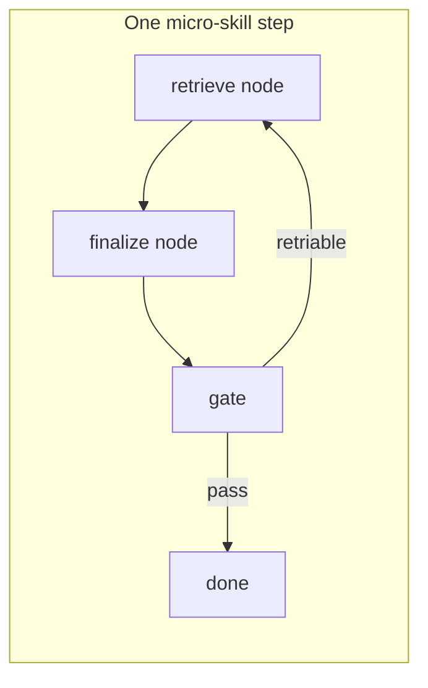

# Mission Readiness Simplification Plan

> **For agentic workers:** REQUIRED SUB-SKILL: Use superpowers:subagent-driven-development (recommended) or superpowers:executing-plans to implement this plan task-by-task. Steps use checkbox (`- [ ]`) syntax for tracking.

**Goal:** Simplify the LangGraph + micro-skill pipeline into a few deep, consistent modules — one contract per concern — without a big-bang rewrite.

**Architecture:** Rebuild from three building blocks only: **retrieve** (main model + tools), **finalize** (deterministic platform), **gate** (one validator per skill). Each chunk lands tests + green unit suite before the next chunk. Solo harness and full chain must use the same gate after each chunk.

**Tech Stack:** LangGraph (`step_pipeline_graph`, `mission_readiness_graph`), micro-skills in `.github/skills/readiness-frame-*`, platform modules in `src/skills/`.

---

## Building blocks (target state)



| Block | Owns | Must NOT own |
|-------|------|--------------|
| **retrieve** | Tool loop, scratchpad, write handoff JSON | Coverage repair, acronym LLM, gate allowlists |
| **finalize** | Normalize shape, deterministic repair, optional expand | Contradictory "partial OK" messaging |
| **gate** | `validate_skill_run` from skill `*_tools.py` | Duplicate rules in `handoff_quality` |

**LangGraph layers (unchanged topology, simpler internals):**

1. `step_pipeline_graph` — retrieve → finalize → conditional retry (per micro-skill)
2. `mission_readiness_graph` — DAG of step pipelines + compile
3. Micro-skill — `SKILL.md` + `*_tools.py` hooks only

---

## Phased chunks (small bites)

### Chunk 1 — One eval gate (solo = chain) ✅ done

**Problem:** Solo `--assess-only` uses `handoff_quality.validate_handoff_artifact` (no acronyms). Chain finalize uses `eval_handoff_tools.validate_skill_run`. Solo green ≠ chain green.

**Files:**
- Modify: `src/skills/handoff_quality.py`
- Test: `tests/skills/test_handoff_quality.py`, `tests/skills/test_readiness_solo_invoke.py`

- [x] Route `validate_step_handoffs` through skill `validate_skill_run` when skill declares hook
- [x] Add test: eval step fails on undefined acronyms via `validate_step_handoffs` / `assess_readiness_solo_step`
- [x] Run: `pytest tests/skills/test_handoff_quality.py tests/skills/test_readiness_solo_invoke.py -q` (19 passed)

**Exit criteria:** Same eval run dir → same issues from solo assess and `platform_eval_finalize`.

---

### Chunk 2 — Retrieve stop signal matches gate ✅ done

**Problem:** `filter_retrieve_only_depth_issues` strips coverage/acronym issues during retrieve; prompt says "platform expander handles coverage." Model stops early (7 tools, 8 rows).

**Files:**
- Modify: `src/skills/depth_gate.py`, `src/skills/skill_tools_runner.py`, `src/skills/research_harness.py`
- Modify: `src/skills/chain_executor.py` (gap-injection prompt text)
- Test: `tests/skills/test_depth_gate.py`

- [x] Remove `filter_retrieve_only_depth_issues` — retrieve uses full `validate_skill_run` / `depth_continue_message`
- [x] Update retry prompt: gate parity with solo assess (no "platform expander handles coverage")
- [x] Test: `test_depth_continue_eval_reports_thin_coverage` (27 passed)

**Exit criteria:** Retrieve loop does not clear with 8 rows when gate needs 24.

---

### Chunk 3 — Finalize: deterministic repair before validate (eval parity with compile) ✅ done

**Problem:** Compile has `repair_compiler_artifacts` pre-gate; eval had LLM expander + admin acronyms, no deterministic repair pass.

**Files:**
- Create: `src/skills/eval_handoff_repair.py`
- Modify: `src/skills/platform_eval_finalize.py`, `src/skills/readiness_solo_invoke.py`
- Test: `tests/skills/test_platform_eval_finalize.py`

- [x] Add `repair_eval_handoff(run_dir)` — dict acronyms (no LLM)
- [x] Call repair before `validate_skill_run` in finalize
- [x] Demote expander/admin to opt-in (`EVAL_EXPANDER_LLM=1`, `EVAL_ADMIN_LLM=1`)
- [x] Eval solo/chain preflight no longer requires Ollama admin

**Exit criteria:** Finalize repairs known acronyms without admin LLM on default path.

---

### Chunk 4 — Unify gate routing for all micro-skills ✅ done

**Problem:** Non-eval micro-skills still used inline rules in `validate_handoff_artifact`; only eval/compile had `validate_skill_run`.

**Files:**
- Create: `src/skills/readiness_handoff_gates.py`
- Create: `.github/skills/readiness-frame-*/**_tools.py` (7 thin hooks)
- Modify: `src/skills/handoff_quality.py`, `src/skills/platform_step_finalize.py`, `mission_readiness_chain.py`
- Test: `tests/skills/test_readiness_handoff_gates.py`

- [x] One skill hook per micro-skill; shared gates in `readiness_handoff_gates.py`
- [x] `platform_step_finalize` + solo assess both route through `validate_skill_run`
- [x] Chain retrieve prompt aligned with gate parity (no "partial OK")

**Exit criteria:** 7 micro-skills + compile all gate through `validate_skill_run` only.

---

### Chunk 5 — Orchestrator prompt slim-down ✅ done

**Problem:** Retry injected `platform_gate_gaps` paragraph soup; duplicated gate messages.

**Files:**
- Modify: `src/skills/chain_executor.py`
- Test: `tests/skills/test_mission_readiness_chain.py`

- [x] Retry context = compact JSON (`gate_gaps`, `retrieve_retry`, `action`)
- [x] Retrieve continuation still from skill `artifact_continue_message` (chunk 2/4)

**Exit criteria:** Retry gap section < 500 chars (tested).

---

### Chunk 6 — Compile path: merge truth, voice optional ✅ done

**Problem:** Compile re-reasoned frame; multiple synthesis/repair/reflexion layers.

**Files:**
- Create: `src/skills/compiler_mode.py`
- Modify: `mission_readiness_merge.py`, `readiness_content_gates.py`, `platform_step_finalize.py`, `research_harness_runner.py`, `skill_tools_runner.py`
- Test: `tests/skills/test_mission_readiness_merge.py`, `tests/skills/test_compiler_mode.py`

- [x] Frame JSON = deterministic merge of handoffs (unchanged merge path, gate frame-first)
- [x] Deterministic `brief.md` from merged frame + executive synthesis
- [x] Optional brief LLM polish via `COMPILER_BRIEF_LLM=1` only
- [x] Compiler gate skips tail-compression / narrative-citation LLM prose requirements

**Exit criteria:** `test_compiler_deterministic_merge_passes_gate_without_llm` green (28 tests).

---

### Chunk 7 — Integration bar

- [ ] One full `invoke_mission_readiness_chain` pass on `mcpp_rfp`
- [ ] Document run id + timing in PR/commit message
- [ ] No new allowlist/dict patches unless gate test proves gap

**Exit criteria:** Full chain completed without eval retry death spiral.

---

## What we stop doing (all chunks)

- Allowlist/dict entries as primary fix
- Solo verify that skips chain gate
- Second admin LLM pass per step on hot path
- Full retrieve retry without fixing stop conditions

---

## Verification commands (per chunk)

```powershell
Set-Location C:\Users\benma\govcon-capture-vibe
.\.venv\Scripts\python.exe -m pytest tests/skills/test_handoff_quality.py tests/skills/test_depth_gate.py tests/skills/test_eval_pipeline_graph.py tests/skills/test_mission_readiness_graph.py -q --tb=short
```

Full chain (Chunk 7 only):

```powershell
.\.venv\Scripts\python.exe tools\invoke_mission_readiness_chain.py
```